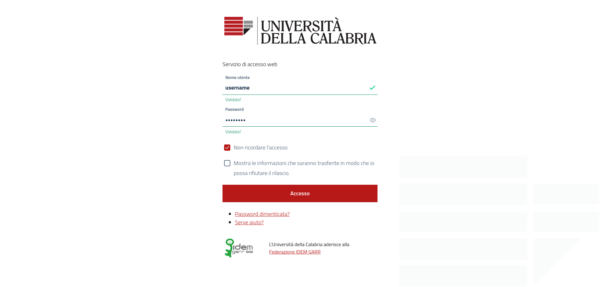
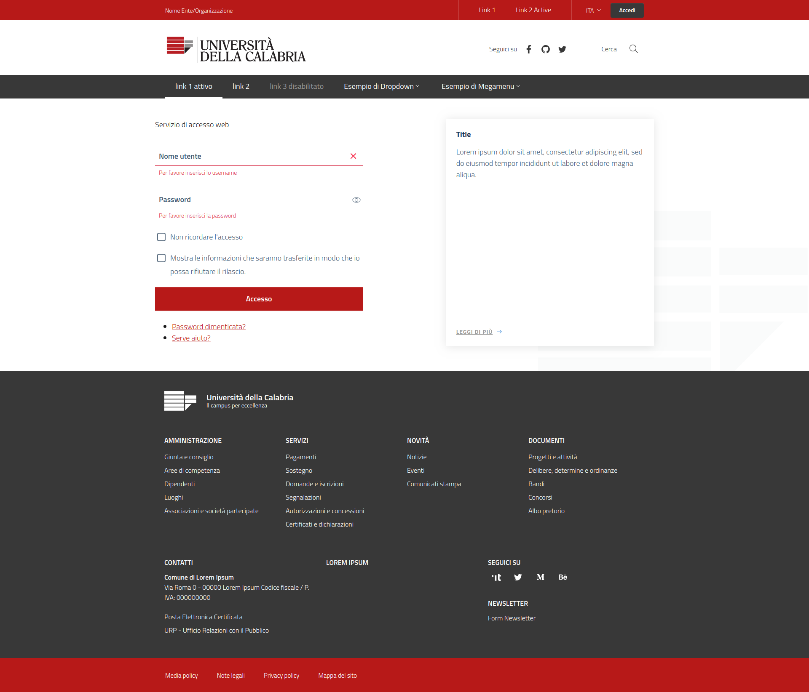

## design-unical-shibboleth-idp-theme

Unical template basato su Bootstrap Italia per Shibboleth IdP > 3.2
-------------------------------------------------------------------

Template per l'Università della Calabria css/html per Shibboleth Identity Provider (IdP ver. > 3.2),
personalizzazione di [design-shibboleth-idp-theme](https://github.com/italia/design-shibboleth-idp-theme),
costruito al di sopra di [Bootstrap Italia v1.3.7](https://italia.github.io/bootstrap-italia/).

Questo progetto eredita tutte le funzionalità, componenti, griglie e classi di utilità definite
nelle [Linee Guida di Design per i siti web della Pubblica Amministrazione](https://docs.italia.it/italia/designers-italia/design-linee-guida-docs/it/stabile/),
mediante i pattern e i componenti definiti nello [UI Kit](https://designers.italia.it/kit/ui-kit/)
di Designers Italia.

[QUI](https://italia.github.io/bootstrap-italia/docs/come-iniziare/introduzione/)
è possibile prendere visione del codice sorgente per l'implementazione di tutti
i componenti grafici messi a disposizione.

Installazione
-------------

Considerando `idp.home` (solitamente /opt/shibboleth-idp) come path di installazione di *shibboleth-idp*, seguire i seguenti passaggi:

- Copiare le cartelle ```edit-webapp``` (file statici) e ```views``` (template) in ```idp.home```;
- Sovrascrivere o integrare i file della cartella ```messages``` in ```idp.home/messages/```;
- Effettuare il rebuild del file WAR tramite linea di comando (```idp.home/bin/build.sh``` o ```idp.home/bin/build.bat```);
- Riavviare il web server (tomcat, jetty o altro servlet container).

Gestione Shibboleth messages
----------------------------

Le stringhe contenute in ```idp.home/messages/messages_XX.properties```
possono essere personalizzate e incluse nel codice dei template.

Esempio di modifica del logo (location: ```idp.home/views/bi_header_wrapper.vm```):

```
<!-- Use Shibboleth logo -->

<!--
<svg class="icon">
    <use xlink:href="$request.getContextPath()/bootstrap-italia/svg/sprite.svg#it-code-circle"></use>
</svg>
```

Versione Lite del template
--------------------------

E' possibile utilizzare il template in versione "leggera" (solo *container*)
semplicemente commentando le righe di codice che renderizzano
*header* ```#parse("bi_header_wrapper.vm")``` e *footer* ```#parse("bi_footer.vm")```
nella pagina.

Galleria
--------


_Login (lite version)_

---------------------------


_Login (full version)_

---------------------------


_Agreement_

